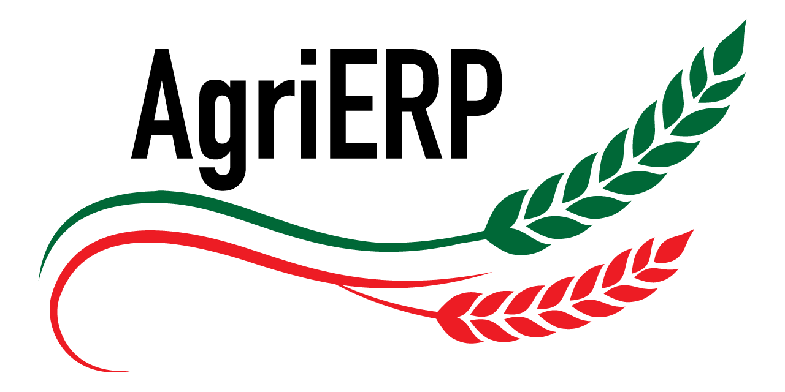

    
    <h1>AgriERP for ERPNext</h1>
     
    

        <h2>ERP module for agriculture</h2>
    

[https://agrierp.lab51.org](https://agrierp.lab51.org)

## AgriERP - ERPNext module for Agriculture and Beekeeping for Italy
### What is this?
With this app you can manage fields, crops, fertilizers, operations, beekeeping and many other functionality through ERPNext (https://www.erpnext.org).

This is a module specifically written in order to abide to Italian laws and rules.
This Readme is also in english because I believe, besides some doctypes specific for Italy, that everything else can be forked or modified through specific branches for any other country.

### But you push commits once a month or less!
Yes, you are right, I am looking for someone that wish to be involved into this project, please let me know if you are interested :)

### Project priorities
1. Because at the moment I am alone, and I would use this app for my company in Italy i will focus on that part first
2. As soon I finish a part that can be stripped from all Italian law requirements, I will push it onto an international branch

### Dive into details
If you are interested or you want to use this module please check the website: [https://agrierp.lab51.org](https://agrierp.lab51.org)

### License
GNU/General Public License (see [license.txt](license.txt))

AgriERPcode is licensed as GNU General Public License (v3) and the Documentation is licensed as Creative Commons (CC-BY-SA-3.0) and the copyright is owned by LAB51 and Contributors.

